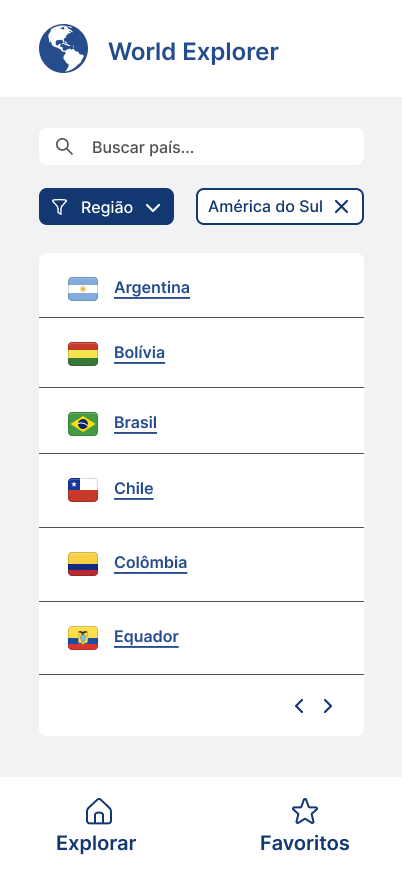
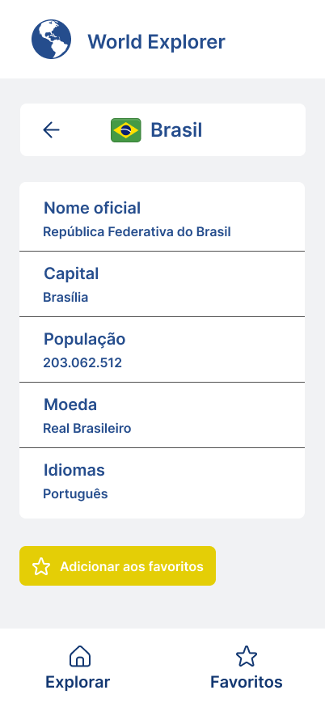
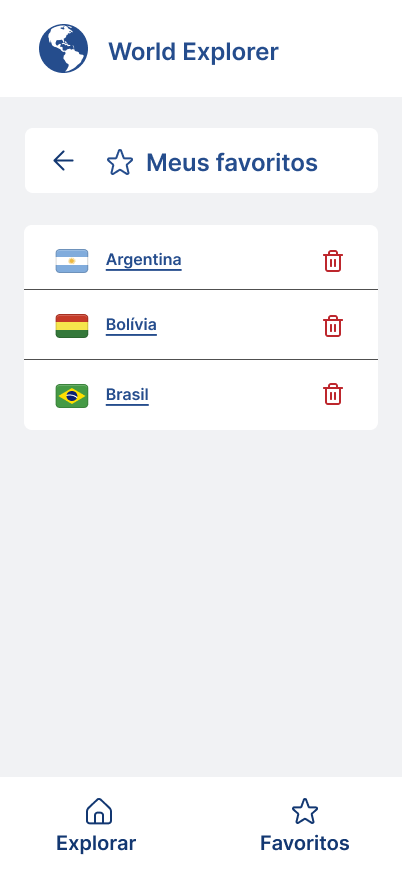

# Protótipos Figma

## Home

Tela principal do sistema.

O usuário poderá:

- Visualizar uma lista de países
- Pesquisar um país pelo nome
- Filtrar os países por região
- Selecionar um país para visualizar seus detalhes
- Navegar para a tela de favoritos

## Detalhes do país

Ao selecionar um país, o usuário será direcionado para uma tela contendo informações detalhadas, como:

- Bandeira
- Nome oficial
- Capital
- População
- Moeda
- Idiomas

Nessa tela também será possível adicionar o país aos favoritos.

## Favoritos

A tela de favoritos apresentará os países que foram salvos pelo usuário.

O usuário poderá:

- Visualizar os países favoritados
- Selecionar um país para consultar seus detalhes
- Remover um país dos favoritos

